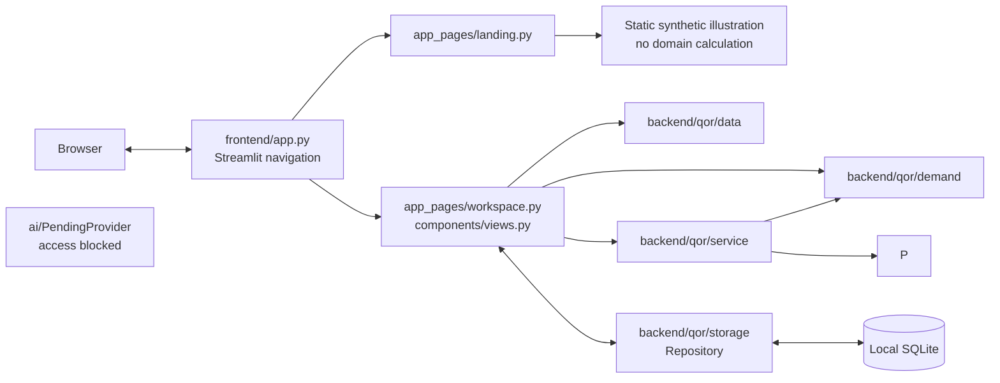
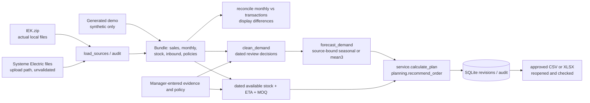
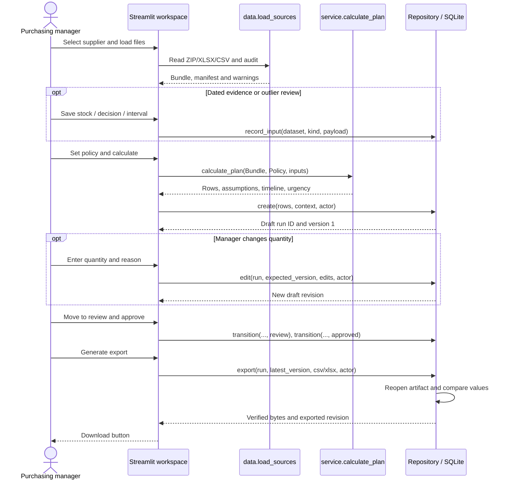
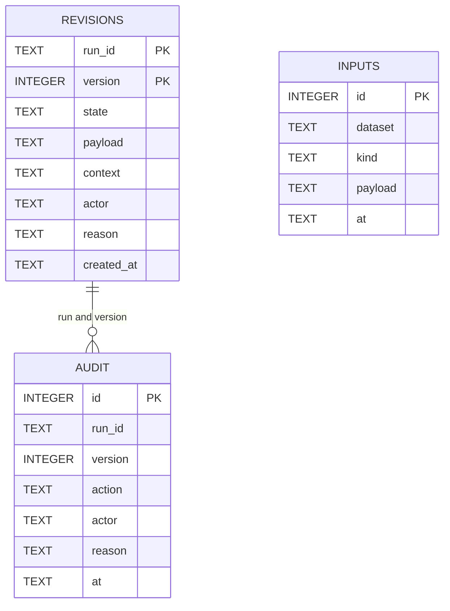
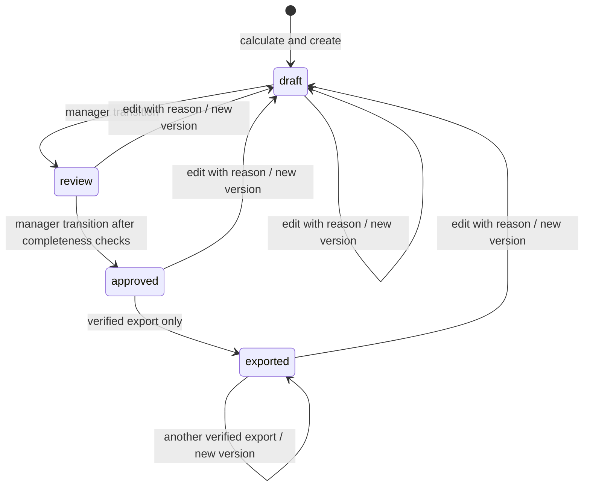

# QOR product and architecture

## Product boundary

QOR supports a purchasing manager preparing supplier replenishment orders from
sales, available stock, pending deliveries and supplier rules. Its current value
is an inspectable decision: a proposed quantity, its inputs, an estimated
shortage date and a human-controlled export. It is a local Streamlit MVP. There
is no login, supplier transmission or verified live AI provider.

The implemented app starts at `frontend/app.py`. `/` is a Russian product
overview with a static, **explicitly synthetic** illustration;
`/workspace` is the buyer's Источники, Спрос, Заказы and Сценарии workspace.
The old root `app.py`/`qor/` files are
retained as legacy code. There is no separate API server.

### Figure 1. Implemented components and boundaries



The AI adapter is intentionally disconnected: `ToolRouter` can invoke bounded
Python calculations locally, but no participant model has been authenticated or
called. Neither the landing page nor workspace presents a mock as live AI.

## Inputs, provenance and operating sequence

The user selects IEK or Systeme Electric explicitly and uploads ZIP/XLSX/UTF-8
CSV. The app also offers the **located local IEK archive** button and a clearly
labeled generated walkthrough. `load_sources()` reads original bytes without
extracting or rewriting a workbook. Each recognized row records supplier,
textual 1C SKU, unit when available, file/sheet/row source and whether the source
is actual or synthetic. Sales keep their document, warehouse, date, positive,
return, zero and missing quantity distinctions. Only an explicitly anonymized
customer ID is accepted. Current stock needs a dated free-stock field; historical
monthly opening balances are not substituted for an IEK snapshot.

### Figure 2. Source and decision data flow



Monthly and transaction values are reconciled, never added for overlapping
months. The September 2026 snapshot month is incomplete and excluded from
forecast fitting. An unrecognized reference sheet is reported instead of being
silently treated as sales. Exact original case DOCX/rules PDF and actual SE
workbooks were not found in the audited locations; SE's canonical path is
tested with fixtures, not claimed as a verified source import.

The buyer's sequence is: import and inspect warnings; enter dated stock if
needed; review a candidate unusual sale or enter evidenced stockout dates;
choose method and lead/review/buffer policy; calculate supplier-specific rows;
inspect timeline and reason; save a reasoned quantity edit if appropriate; move
draft to review, then approved; generate an artifact and reopen it for comparison;
download. The app does not dispatch it.

### Figure 3. Implemented manager calculation and export sequence



Each `transition` checks the latest version; an edit creates a new draft
revision and resets approval. Incomplete rows cannot be approved. A displayed
manager name is an audit label, not authenticated identity.

## Decision logic and public interfaces

`backend/qor/contracts.py` validates `Policy`, `StockInput`, `Stockout`,
`OutlierDecision` and `ToolRequest`. The public calculation functions currently
used by the app are:

| Interface | Input → result | Actual use |
|---|---|---|
| `data.load_sources(sources, supplier=None, snapshot=SNAPSHOT)` | Paths or `(name, bytes, supplier)` → `Bundle` | ZIP/XLSX/CSV import |
| `data.reconcile(bundle)` | `Bundle` → monthly difference table | Data view |
| `demand.clean_demand(events, ..., decisions, as_of)` | Sales frame → annotated frame | Candidate/review display |
| `demand.forecast_demand(events, snapshot, days, policy, decisions, stockouts, monthly, method)` | History/policy → daily forecast, history, notes | Demand and Orders |
| `demand.evaluate(events, snapshot, monthly, decisions, max_origins=6)` | History → rolling-origin results | Demand view |
| `planning.project_inventory(free_stock, demand, inbound, snapshot)` | Dated inputs → daily timeline | Planning core |
| `planning.recommend_order(...)` | Supplier/SKU, stock, demand, ETA, MOQ/pack, policy → auditable row | Service and scenarios; landing is static |
| `service.calculate_plan(bundle, policy, *, keys, stock_inputs, decisions, stockouts)` | Audited bundle and evidence → supplier rows | Orders/Scenarios |
| `storage.Repository(path)` | Local SQLite workflow object | Inputs, revisions, approval, export |
| `ai.ToolRouter.call(arguments)` | One of four validated local operations → deterministic result | Implemented boundary, no model call |

Outlier candidates are calculated at document/day level against up to 60 prior
documents using a log median and median absolute deviation. When an anonymized
client ID exists, a concentrated one-client document can also be flagged. The
original sale is retained; an unreviewed candidate is capped only in forecast
input. A dated, reasoned `keep` or `exclude` decision overrides that cap.
Sustained growth remains in normal history. Returns do not become negative
demand. No customer conclusion is made from the real files, which have no
anonymized IDs; that branch is demonstrated with generated IDs.

Forecasting uses 2024 monthly history and 2025+ transactions without overlap.
The seasonal candidate builds factors from complete earlier years, then applies
them to a recent deseasonalized level; a three-month mean baseline is also
available. An offline 21-day grouped holdout compares those baselines with a
local CPU HistGradientBoostingRegressor challenger; it did not win on the
audited IEK sample. `auto` uses only a source/horizon/SKU-matched selected
baseline and labels a seasonal fallback otherwise. The manager can still
select a baseline explicitly. File growth, if manually confirmed, applies once to the
corresponding prior-year month. Confirmed stockout intervals may add estimated
lost demand using prior observed days; an unconfirmed interval does not change
the main forecast. Hypothetical unknown-stockout days are separate scenarios.

The default scenario uses lead `L=14`, review `R=7`, buffer `S=7` days. From
available stock `F`, forecast demand `d` and dated receipts `I`:

```text
P(t) = F + sum(I with ETA <= t) - sum(d through t)
buffer(t) = sum(d for the following S days)
raw_need = max(0, max(buffer(t) - P(t)) for t = L .. L+R)
if raw_need > 0: order = ceil(max(raw_need, MOQ) / pack_multiple) * pack_multiple
```

The pack rule is only applied when supplied. Missing pack rules can leave a
fractional quantity requiring manager review. Available stock is used once;
reservations are not deducted a second time. Pending receipts with unknown ETA
or ETA on/before the snapshot do not count as future arrivals. A negative daily
projection before `L` is flagged `expedite` and remains visible even if a later
receipt makes the final balance positive. The first shortage date is a forecast,
not a confirmed stockout. IEK's dispatch field can mean minimum or multiple;
the selected interpretation is saved in the calculation policy.

| Manager change | Effect on the next calculation | What remains a fact |
|---|---|---|
| Lead time | Changes arrival day, forecast horizon, binding window, shortage urgency and quantity; 7/14/30 comparison is available | Existing source rows stay unchanged |
| Inbound ETA delay or assignment | Moves scenario receipt to a different day; earlier deficits stay visible | Original ETA remains in the imported source |
| Category buffer | Overrides `S` for matching raw category code and changes forward target demand | The code's business meaning is not inferred |
| One-off sale decision | A dated keep/exclude decision changes cleaned demand, forecast and new draft | Original transaction stays in the audit source |

Saving a new policy does not mutate an old run; the manager must recalculate.
The UI shows prior versions and the context saved with each calculation.

## Storage and approval

### Figure 4. Actual SQLite tables (logical relationships only)



`revisions` has a composite `(run_id, version)` primary key. `audit` records
actions with its own ID. `inputs` stores dataset-scoped stock, outlier and
stockout JSON separately. There are **no SQL foreign-key constraints**; the ER
edge indicates the application's logical `run_id`/`version` relationship. There
are no separate suppliers, users, customers or order-line tables in this MVP.

### Figure 5. Implemented order state machine



Only `Repository.export` produces the exported state after writing CSV/XLSX
and reopening it to compare values. There is no outbound supplier message.

## AI status, evidence and limitations

`ai/PendingProvider` explicitly raises a blocked result. A local `ToolRouter`
validates and limits `inspect_data`, `calculate_plan`, `simulate_policy` and
`explain_sku`, but it is not connected to a hosted or local language model.
No organizer provider, endpoint, authorized model/deployment ID, participant
credential, checkpoint, license or runner instructions were found. A public
event announcement does not establish access for this participant. No model SDK
or weights were installed, and no live text or tool-call success is claimed.
An actual integration needs those participant items, the documented runtime,
and live probes. Python remains authoritative for all quantities.

Potential business value has levels of evidence:

| Benefit | Evidence level |
|---|---|
| Less manual consolidation | Implemented workflow combines audited source tables; time saved has not been measured |
| More frequent order review | Recalculation and 7/14/30 scenarios are available; cadence improvement has not been measured |
| Supplier-grouped, traceable draft | Synthetic workflow test and real IEK missing-stock gate verified |
| Avoid hidden early shortages | ETA and pre-lead shortage tests pass; operational outcomes unmeasured |
| Human-controlled export | SQLite workflow and reopened artifact tests pass |

Operational blockers: current IEK available stock; real SE source files and
header validation; evidence for stockout days, lead/ETA reliability, purchase
units, pack rules and growth; authenticated manager roles; and participant
model access. The app is a local single-user MVP with no encrypted DB or
production deployment controls. No prices, savings or production accuracy
claims are made. See [product audit](PRODUCT_AUDIT.md) and
[feature matrix](FEATURE_MATRIX.md) for requirement-by-requirement evidence.
